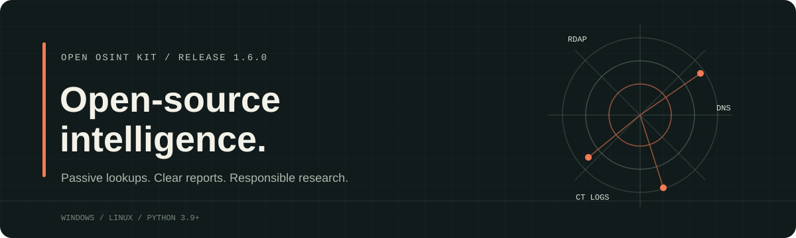

# Open OSINT Kit 1.5.2



Cross-platform Python CLI for authorized research into domains, infrastructure, and public indicators. Phone-number analysis uses the `phonenumbers` library.

## Features

`domain` gathers RDAP, DNS (A, AAAA, MX, NS, TXT, and CAA) over DNS-over-HTTPS, and Certificate Transparency records. Each source fails independently.

`ip` checks RDAP and reverse DNS for a public address. Private, local, and reserved IP addresses are rejected.

`ioc` classifies domains, IP addresses, HTTP(S) URLs, and MD5/SHA1/SHA256 hashes, then generates links to public services such as VirusTotal, AlienVault OTX, URLhaus, AbuseIPDB, and CIRCL Hashlookup. Indicators are not submitted automatically.

`search` generates manual search links for usernames, people, companies, and organizations. It does not scrape profiles, collect search results, or verify identities.

`profiles` checks one username against public APIs for GitHub, GitLab, DEV Community, Hacker News, Bluesky, Reddit, Mastodon.social, Codeberg, Hugging Face, Bugcrowd, YesWeHack, and Intigriti, and confirms HackerOne profile routes. Confirmed bug bounty accounts are labeled `bug bounty` and prioritized after social networks/forums. It displays only exact confirmed matches with their category and public profile URL; missing accounts, generic pages, and unavailable APIs are omitted. For Bluesky, a username without a domain is checked as `<username>.bsky.social`. Mastodon checks the `mastodon.social` instance only.

`phone` validates an international E.164 number and reports its formatting, numbering-plan region, and line type. It does not query carriers, identify owners, or verify that a line is active.

`shodan` performs a passive indexed-data lookup for one public IP. It returns hostnames, domains, organization, ISP, ASN, country code, and last update only; it does not scan or return ports, banners, or vulnerability data.

`shodan-range` searches Shodan's existing index for public IPv4/IPv6 CIDR ranges up to 256 addresses (`/24` IPv4 or `/120` IPv6). `asn` searches indexed hosts by autonomous system number. Both commands paginate sequentially up to 500 results, cache successful results for five minutes by default, and return partial results if a later page is rate-limited; they never initiate scans.

`config set-shodan-key` prompts for the key without echoing it and stores it in the operating system keyring. `SHODAN_API_KEY` is also supported and takes precedence. The key is never printed or included in reports.

Terminal help and JSON output use color by default. Rich automatically disables color when output is redirected; set `NO_COLOR=1` to disable it explicitly.

`--update` checks this repository's latest stable release and, when a newer version is available, installs the source archive for that release tag with `pip`. If the version is unchanged, it compares the installed release or commit against `main`; newer commits are installed by SHA. The SHA recorded by `pip` is reused on later checks, so an already-installed commit is not repeatedly reinstalled.

`compare old-report.json new-report.json` produces a local field-level diff and ignores generated timestamps and cache metadata.

For sites without a reliable public profile API, `search --kind username` also creates manual search links for HackerOne, Bugcrowd, YesWeHack, Intigriti, TryHackMe, Hack The Box, LinkedIn, Wellfound, and Indeed, prioritized before general search engines. These are search links, not confirmed profile results.

## Installation

Requires Python 3.9 or later and `pip`. The first installation needs an internet connection to resolve dependencies and the build backend. Installation is per-user and does not require administrator privileges.

On Windows, run from the repository root:

```powershell
powershell -ExecutionPolicy Bypass -File .\install.ps1
osint-kit --help
```

On Linux, run from the repository root:

```bash
bash ./install.sh
osint-kit --help
```

The installers add the command directory to the invoking user's PATH and show verbose `pip` output by default. On Linux, the application runs as the invoking user in an isolated virtual environment under `~/.local/share/open-osint-kit`; the installer does not create a shared service account or group. Open a new terminal after installation to apply the updated PATH to other sessions.

## Uninstallation

On Windows, run from PowerShell and the repository root:

```powershell
powershell -ExecutionPolicy Bypass -File .\uninstall.ps1
```

On Linux, run from the repository root:

```bash
bash ./uninstall.sh
```

The uninstaller removes the per-user package on Windows or the kit's virtual environment and launcher on Linux. It does not uninstall shared Python dependencies. It removes a PATH entry only when a recent installer recorded that it added the entry. Installations older than 1.1.1 may leave a shared PATH entry; in that case, it is preserved to avoid affecting other tools. During an interactive uninstall, you can confirm optional removal of generated `build`, `dist`, `egg-info`, and `__pycache__` artifacts, the Shodan cache, and the Shodan key from the OS keyring. Reports saved to user-selected `--output` paths and environment variables such as `SHODAN_API_KEY` are never deleted. Non-interactive uninstall keeps generated data and the key by default.

## Usage

```text
osint-kit --update
osint-kit --version
osint-kit domain example.org
osint-kit domain example.org --output domain-report.json
osint-kit ip 8.8.8.8 --output ip-report.json
osint-kit ioc example.org
osint-kit ioc 44d88612fea8a8f36de82e1278abb02f
osint-kit search ExampleOrg --kind organization
osint-kit search example_user --kind username --output search.json
osint-kit search "Jane Example" --kind person
osint-kit search "Example Inc" --kind company
osint-kit profiles example_user --timeout 5 --output profiles.json
osint-kit search example_user --kind username
osint-kit phone +14155552671
osint-kit config set-shodan-key
osint-kit config status
osint-kit shodan 8.8.8.8 --output shodan-report.json
osint-kit shodan-range 8.8.8.0/24 --limit 25
osint-kit shodan-range 2606:4700::/120
osint-kit asn AS15169 --limit 50
osint-kit compare previous-report.json current-report.json
osint-kit config test-shodan
osint-kit config clear-cache
osint-kit config remove-shodan-key
```

Shodan results are cached per user for five minutes under `%LOCALAPPDATA%\open-osint-kit\shodan` on Windows or `$XDG_CACHE_HOME/open-osint-kit/shodan` (default `~/.cache/open-osint-kit/shodan`) on Linux. Set `--cache-ttl 0` to disable caching; `config clear-cache` removes the cache without deleting reports saved to user-selected paths.

`domain`, `ip`, `profiles`, `shodan`, `shodan-range`, `asn`, `config test-shodan`, and `--update` require an internet connection. `ioc`, `search`, the other `config` actions, and `phone` do not make research lookups; `phone` analyzes numbering-plan metadata locally. The `domain` and `ip` timeouts apply per source, so a full run may take longer than the configured timeout. `profiles` queries each supported API once, concurrently, and may omit services that rate-limit or cannot be reached.

## Tests

Run the local suite with `python -m unittest discover -s tests -v`. GitHub Actions runs it on Windows and Linux with Python 3.9, 3.11, and 3.13.

## Responsible Use

Use the kit only for legitimate, authorized research. It does not scan ports, authenticate, or exploit systems. `search` provides links that the user chooses whether to open and is limited to public/professional sources; `profiles` sends the supplied username to the listed APIs and only displays exact matches, without retaining profile details. A match does not prove that accounts belong to the same person. `phone` does not identify the owner. Do not use the tool to locate people or collect home addresses, private data, family details, or sensitive information. URLs with query strings are rejected to reduce the risk of exposing tokens or secrets. Public data may be incomplete, outdated, or subject to terms of use; verify findings before relying on them.
